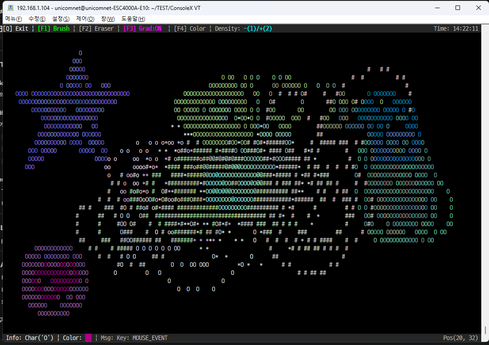

# ConsoleX

**ConsoleX**는 리눅스 터미널 환경에서 고성능 비동기 입력 처리와 모던한 TUI(Text-based User Interface)를 구현하기 위한 경량 C++ 라이브러리입니다.

이 프로젝트에는 라이브러리의 강력한 기능을 시연하기 위해 **그림판(DrawApp)** 과 **윈도우 매니저 스타일의 인벤토리(ItemApp)**, 두 가지 예제 애플리케이션이 포함되어 있습니다.

<p align="center"></p>

## ✨ Key Features

### 🛠 Core Library (`cx_*`)

* **비동기 입력 처리 (`cx_device`)**: `select()` 기반의 멀티플렉싱을 통해 키보드와 마우스 입력을 넌블로킹(Non-blocking)으로 처리합니다.
* **고급 파싱 지원**: xterm, VT100, Tera Term 등 다양한 터미널의 이스케이프 시퀀스(F1~F12, Backspace 등)를 호환성 있게 처리합니다. **키보드 즉시 입력** 및 **마우스 클릭, 드래그 이벤트** 등을 정밀하게 파싱합니다.
* **RGB 트루컬러 지원 (`cx_color`)**: 24-bit RGB 색상을 지원하며, ANSI 코드로 자동 변환합니다.
* **UTF-8 완벽 지원 (`cx_util`)**: 한글, 한자, 이모지(Emoji) 등의 Double-Width 문자와 결합 문자(ZWJ)의 너비를 정확하게 계산하여 UI 깨짐을 방지합니다.
* **최적화된 렌더링**: Double Buffering 및 Differential Rendering(차분 렌더링) 기법을 통해 화면 깜빡임(Flickering) 없는 부드러운 UI를 제공합니다.

### 🎨 Demo Applications

#### 1. Drawing App (`DrawApp`)

* **기능**: 터미널 상에서 마우스 드래그를 이용한 자유 곡선 그리기.
* **도구**: 브러시(밀도/그라데이션 조절), 지우개(가변 크기/하이라이트), 실시간 헥사 컬러 입력.

#### 2. Inventory Manager (`ItemApp`)

* **기능**: 윈도우 매니저 스타일의 인벤토리 관리 시스템.
* **윈도우 관리**: 인벤토리 창 이동(Move), 크기 조절(Resize), 충돌 감지 및 자동 회피.
* **아이템 관리**: 마우스 드래그 앤 드롭을 통한 인벤토리 간 아이템 이동.
* **레이아웃 모드**: F1(최대화/타일링) 및 F2(원상 복구) 모드 지원.

---

## 📂 Project Structure

```bash
ConsoleX/
├── example/           # 예제 애플리케이션 소스
│   ├── main_draw_app.cpp  # 그림판 앱
│   └── main_item_app.cpp  # 인벤토리 앱
├── include/           # 라이브러리 헤더 파일
│   ├── ConsoleX.hpp   # 통합 헤더
│   ├── cx_color.hpp   # 색상 처리
│   ├── cx_device.hpp  # 입력 파싱
│   ├── cx_screen.hpp  # 화면 제어
│   └── cx_util.hpp    # 문자열 유틸리티
├── src/               # 코어 라이브러리 구현부
│   ├── cx_color.cpp
│   ├── cx_device.cpp
│   ├── cx_screen.cpp
│   └── cx_util.cpp
└── CMakeLists.txt     # 빌드 설정

```

---

## 🚀 Build & Run

### Prerequisites

* **C++17** 호환 컴파일러 (GCC, Clang)
* CMake 3.10 이상
* Linux/macOS 환경 (또는 WSL)

### Build Steps

```bash
# 1. 프로젝트 클론
git clone https://github.com/so686so/ConsoleX.git
cd ConsoleX

# 2. 빌드 디렉토리 생성 및 컴파일
mkdir build && cd build
cmake ..
make -j4

# 3. 실행 (프로젝트 루트 디렉토리에 실행 파일 생성됨)
cd ..
./DrawApp   # 그림판 앱 실행
./ItemApp   # 인벤토리 앱 실행

```

---

## 🎮 User Manual

### 1. Drawing App (`DrawApp`)

| Key / Action | Function | Description |
| --- | --- | --- |
| **F1** | **Brush Mode** | 브러시 모드로 전환합니다. |
| **F2** | **Eraser Mode** | 지우개 모드로 전환합니다. |
| **F3** | **Gradient** | 그라데이션 효과를 ON/OFF 토글합니다. |
| **F4** | **Color Input** | Hex Code 색상 입력 모드로 진입합니다. |
| **+ / -** | **Control** | 브러시 밀도를 조절하거나 지우개 크기를 변경합니다. |
| **L-Click Drag** | **Draw** | 그림을 그리거나 지웁니다. |
| **M-Click** | **Clear** | 화면 전체를 지웁니다. |

### 2. Inventory App (`ItemApp`)

| Key / Action | Function | Description |
| --- | --- | --- |
| **F1** | **Maximize** | 모든 인벤토리 창을 화면에 꽉 차게 정렬(Tiling)합니다. |
| **F2** | **Restore** | 인벤토리 창을 원래 위치와 크기로 복구합니다. |
| **Q** | **Quit** | 프로그램을 종료합니다. |
| **Drag Header** | **Move Window** | 인벤토리 상단 바(`[-]`)를 잡고 창을 이동합니다. |
| **Click Header** | **Sort Items** | 상단 바를 클릭(이동 없이)하면 아이템을 이름순 정렬합니다. |
| **Drag Edge** | **Resize** | 인벤토리 우측/하단 모서리를 잡고 크기를 조절합니다. |
| **Drag Item** | **Move Item** | 아이템을 드래그하여 다른 인벤토리로 이동시킵니다. (녹색 테두리: 이동 가능) |

---

## 🔧 Technical Details

### 1. Double Buffering & Differential Rendering (`ItemApp`)

`ItemApp`은 화면 전체를 매 프레임 지우고 다시 그리는 대신, **가상 버퍼(Virtual Buffer)** 시스템을 사용합니다.

* **Front/Back Buffer**: 현재 화면과 다음 화면을 메모리에 유지합니다.
* **Diff Algorithm**: 두 버퍼를 비교하여 **변경된 문자(Cell)**만 선별적으로 터미널에 전송합니다.
* **Optimization**: 커서 이동 명령을 최소화하고 색상 변경 코드를 최적화하여, 복잡한 UI 갱신 시에도 깜빡임 없는(Flicker-free) 화면을 제공합니다.

### 2. Window Management Logic

* **Clamping**: 윈도우 이동 시 화면 밖으로 벗어나지 않도록 좌표를 자동 보정합니다.
* **Collision Detection**: 윈도우 간 겹침을 감지하여 붉은 테두리로 경고하고, 드롭 시 빈 공간(좌상단 우선)을 찾아 자동으로 배치합니다.
* **Elastic Resizing**: 리사이즈 중에는 자유롭게 크기를 조절하다가, 마우스를 놓으면 내용물(아이템 목록) 크기에 맞춰 자동으로 높이가 스냅(Snap)됩니다.

---

## 📝 License

This project is licensed under the MIT License - see the [LICENSE](https://www.google.com/search?q=LICENSE) file for details.
